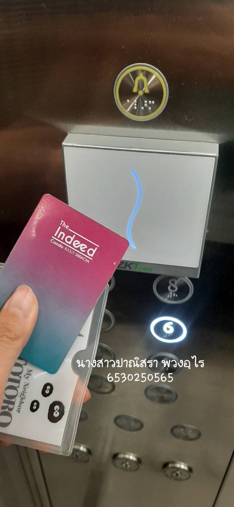

# 🔐 Security Control

---

## 🛗 Elevator Floor Lock System

*Access Control System for Elevators* หรือ *Elevator Floor Lock System* คือระบบที่ออกแบบมาเพื่อควบคุมการเข้าถึงชั้นต่างๆ ในลิฟต์ 
โดยจะทำงานร่วมกับ **Security Control** เพื่อเพิ่มระดับความปลอดภัยในอาคาร เช่น อาคารสำนักงาน คอนโดมิเนียม หรือโรงแรม

### Location

Elevator Floor Lock System ที่คอนโด **The Indeed Condo Kaset Sriracha**

---

### 📌Type of Security Controls: **Physical Controls**

**Access Control System**  เป็นตัวอย่างของ **Physical Controls** 
ที่ใช้จำกัดการเข้าถึงภายในอาคารโดยอาศัยเทคโนโลยีรักษาความปลอดภัย

- **Keycard หรือ RFID Card**
    - ผู้ใช้งานต้องแตะบัตรเพื่อเข้าถึงชั้นที่ได้รับอนุญาต

---

### 📌Control Functions: **Preventive Controls**

**Access Control System** ทำหน้าที่เป็น **Preventive Controls**
เพื่อลดความเสี่ยงจากการบุกรุกและป้องกันการเข้าถึงที่ไม่ได้รับอนุญาต โดยใช้มาตรการดังนี้

- **กำหนดสิทธิ์การเข้าถึง**
    - ระบบอนุญาตให้เข้าถึงเฉพาะชั้นที่กำหนด เช่น พนักงานสามารถเข้าชั้นของแผนกตัวเองเท่านั้น
- **ล็อกปุ่มลิฟต์ที่ไม่ได้รับอนุญาต**
    - หากไม่ได้ยืนยันตัวตน ระบบจะปิดกั้นการกดปุ่มไปยังชั้นที่ไม่ได้รับอนุญาต
- **ควบคุมในกรณีฉุกเฉิน**
    - ระบบสามารถปลดล็อกชั้นทั้งหมดหรือให้พนักงานรักษาความปลอดภัยควบคุมได้

---

## สรุป
ระบบ **Access Control** เป็น **Physical Controls** ที่ช่วยจำกัดการเข้าถึงพื้นที่สำคัญ เช่น ชั้นผู้บริหาร ห้องเซิร์ฟเวอร์ หรือที่พักส่วนตัว 
นอกจากนี้ยังทำหน้าที่เป็น **Preventive Controls** โดยช่วยลดความเสี่ยงจากการบุกรุกและสามารถตรวจสอบย้อนหลังได้ว่าใครเข้าถึงพื้นที่ใดบ้าง

---
